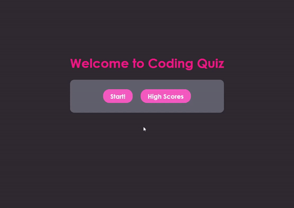

# <Coding-Quiz>
# Coding Quiz

## Description

This application was built in order to create a timed quiz on JavaScript fundamentals. As the assignment did not provide starter code, I began by building the HTML files that would house all of the basic hardcoded data as well as empty div elements with only classes and ids that would be called on later in the JavaScript. Next I created the CSS stylesheet to style and format the website and buttons created by JS. I chose a darker theme as “dark mode” is becoming increasingly popular and desired among users. I wrote two separate JavaScript files; one for the functionality of the actual quiz and another to display scores. The scores.js file contains one function that pulls from local storage and displays that information on the page and offers the user an option to restart the quiz. 

The quiz functionality is all stored in the script.js file as is the array containing the questions, options, and answers for the quiz. The functionality consists of variables that grab and create HTML elements and five functions that take care of the timer, displaying questions and options, checking answers, scoring, and locally storing scores and submitted initials. When the user clicks “Start!” the thirty second timer is displayed immediately and begins to countdown every second. When the user clicks on the correct answer their score increases by one, when they click on the incorrect answer five seconds are subtracted from the timer. New questions and answers are displayed until all questions have been asked or the timer runs out. Based on the user’s score a win or lose message is displayed along with their score and they are asked to enter their initials in a form. When the form submit button is clicked a thank you message is displayed and options to restart the quiz or view scores appear. “Play Again?” redirects the user to the start page while the “High Scores” button redirects them to the scores page that displays their submitted initials along with their previous score. Finally, the scores page offers a “Restart” button that redirects the user to the start page.

The code has detailed comments on the functionality and why certain elements are necessary to ensure the functions perform correctly and display the appropriate information.

---

## Usage

To view the website application please follow the provided link: 
https://emmasiren.github.io/Coding-Quiz/

The following image shows the web application when loaded correctly.
